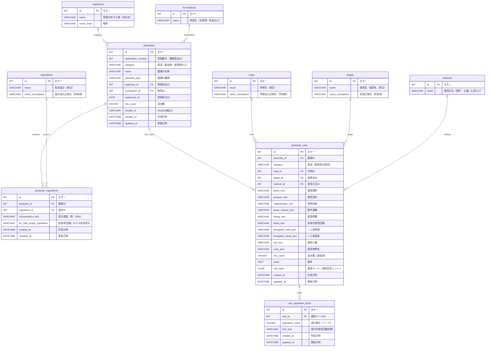

# カケトコDB ver.2 設計

## ER図

## テーブル一覧

pesticides
registrants
formulations
ingredients
pesticide_ingredients
crops
targets
methods
pesticide_rules
rule_ingredient_limits

**pesticides（農薬マスタ）**

| **カラム**          | **型**     | **説明**                   |
| ------------------- | ---------- | -------------------------- |
| id                  | INT PK     | 主キー                     |
| registration_number | INT UNIQUE | 登録番号                   |
| category            | VARCHAR    | 用途（殺虫剤・殺菌剤など） |
| name                | VARCHAR    | 農薬の名称                 |
| pesticide_type      | VARCHAR    | 農薬の種類                 |
| registrant_id       | INT FK     | 登録を有する者             |
| formulation_id      | INT FK     | 剤型                       |
| registered_on       | DATE       | 登録年月日                 |
| mix_count           | TINYINT    | 混合数                     |
| shopify_id          | VARCHAR    | Shopify商品ID              |
| created_at          | DATETIME   | 作成日時                   |
| updated_at          | DATETIME   | 更新日時                   |

**registrants（登録会社）**

| **カラム** | **型**         | **説明**                 |
| ---------- | -------------- | ------------------------ |
| id         | INT PK         | 主キー                   |
| name       | VARCHAR UNIQUE | 登録を有する者（会社名） |
| name_short | VARCHAR        | 略称                     |
| created_at | DATETIME       | 作成日時                 |
| updated_at | DATETIME       | 更新日時                 |

**formulations（剤型）**

| **カラム** | **型**         | **説明**                   |
| ---------- | -------------- | -------------------------- |
| id         | INT PK         | 主キー                     |
| name       | VARCHAR UNIQUE | 剤型名（水和剤・乳剤など） |
| created_at | DATETIME       | 作成日時                   |
| updated_at | DATETIME       | 更新日時                   |

**ingredients（有効成分）**

| **カラム**      | **型**         | **説明**     |
| --------------- | -------------- | ------------ |
| id              | INT PK         | 主キー       |
| name            | VARCHAR UNIQUE | 有効成分名   |
| name_normalized | VARCHAR        | 正規化成分名 |
| created_at      | DATETIME       | 作成日時     |
| updated_at      | DATETIME       | 更新日時     |

**pesticide_ingredients（農薬×成分）**

| **カラム**                | **型**   | **説明**                   |
| ------------------------- | -------- | -------------------------- |
| id                        | INT PK   | 主キー                     |
| pesticide_id              | INT FK   | 農薬ID                     |
| ingredient_id             | INT FK   | 成分ID                     |
| concentration_text        | VARCHAR  | 成分濃度                   |
| as_total_usage_ingredient | VARCHAR  | 総使用回数における有効成分 |
| created_at                | DATETIME | 作成日時                   |
| updated_at                | DATETIME | 更新日時                   |

UNIQUE:(pesticide_id, ingredient_id)

**crops（作物辞書）**

| **カラム**      | **型**         | **説明**     |
| --------------- | -------------- | ------------ |
| id              | INT PK         | 主キー       |
| name            | VARCHAR UNIQUE | 作物名       |
| name_normalized | VARCHAR        | 作物名正規化 |
| created_at      | DATETIME       | 作成日時     |
| updated_at      | DATETIME       | 更新日時     |

**targets（病害虫雑草）**

| **カラム**      | **型**         | **説明**     |
| --------------- | -------------- | ------------ |
| id              | INT PK         | 主キー       |
| name            | VARCHAR UNIQUE | 病害虫雑草名 |
| name_normalized | VARCHAR        | 名称正規化   |
| created_at      | DATETIME       | 作成日時     |
| updated_at      | DATETIME       | 更新日時     |

**methods（使用方法）**

| **カラム** | **型**         | **説明**             |
| ---------- | -------------- | -------------------- |
| id         | INT PK         | 主キー               |
| name       | VARCHAR UNIQUE | 使用方法（散布など） |
| created_at | DATETIME       | 作成日時             |
| updated_at | DATETIME       | 更新日時             |

**pesticide_rules（適用ルール）**

| **カラム**           | **型**   | **説明**                            |
| -------------------- | -------- | ----------------------------------- |
| id                   | INT PK   | 主キー                              |
| pesticide_id         | INT FK   | 農薬ID                              |
| category             | VARCHAR  | 用途                                |
| crop_id              | INT FK   | 作物                                |
| target_id            | INT FK   | 病害虫                              |
| method_id            | INT FK   | 使用方法                            |
| place_text           | VARCHAR  | 適用場所                            |
| purpose_text         | VARCHAR  | 使用目的                            |
| magnification_text   | VARCHAR  | 希釈倍率                            |
| spray_volume_text    | VARCHAR  | 散布液量                            |
| timing_text          | VARCHAR  | 使用時期                            |
| times_text           | VARCHAR  | 使用回数                            |
| fumigation_time_text | VARCHAR  | くん蒸時間                          |
| fumigation_temp_text | VARCHAR  | くん蒸温度                          |
| soil_text            | VARCHAR  | 適用土壌                            |
| zone_text            | VARCHAR  | 適用地帯                            |
| mix_count            | TINYINT  | 混合数                              |
| notes                | TEXT     | 備考                                |
| rule_hash            | CHAR(32) | 適用ルール一意判定用ハッシュ（MD5） |
| created_at           | DATETIME | 作成日時                            |
| updated_at           | DATETIME | 更新日時                            |

UNIQUE:(rule_hash)

**rule_ingredient_limits（成分別使用回数）**

| **カラム**       | **型**   | **説明**           |
| ---------------- | -------- | ------------------ |
| id               | INT PK   | 主キー             |
| rule_id          | INT FK   | 適用ルールID       |
| ingredient_order | TINYINT  | 成分番号①〜⑤       |
| limit_text       | VARCHAR  | 成分別使用回数制限 |
| created_at       | DATETIME | 作成日時           |
| updated_at       | DATETIME | 更新日時           |

UNIQUE:(rule_id, ingredient_order)

**rule_hash の生成ルール**

rule_hash = MD5(
　pesticide_id +
　crop_id +
　target_id +
　method_id +
　magnification_text +
　timing_text +
　times_text +
　place_text
　)

## CSV→テーブルカラム対応表

**登録基本部**

| **CSV列**                  | **DBテーブル**        | **DBカラム**              |
| -------------------------- | --------------------- | ------------------------- |
| 登録番号                   | pesticides            | registration_number       |
| 農薬の種類                 | pesticides            | pesticide_type            |
| 農薬の名称                 | pesticides            | name                      |
| 正式名称                   | registrants           | name                      |
| 正式名称                   | pesticides            | registrant_id             |
| 有効成分                   | ingredients           | name                      |
| 有効成分                   | pesticide_ingredients | ingredient_id             |
| 総使用回数における有効成分 | pesticide_ingredients | as_total_usage_ingredient |
| 濃度                       | pesticide_ingredients | concentration_text        |
| 混合数                     | pesticides            | mix_count                 |
| 用途                       | pesticides            | category                  |
| 剤型名                     | formulations          | name                      |
| 剤型名                     | pesticides            | formulation_id            |
| 登録年月日                 | pesticides            | registered_on             |

**登録適用部**

| **CSV列**              | **DBテーブル**         | **DBカラム**         |
| ---------------------- | ---------------------- | -------------------- |
| 登録番号               | pesticide_rules        | pesticide_id         |
| 用途                   | pesticide_rules        | category             |
| 作物名                 | crops                  | name                 |
| 作物名                 | pesticide_rules        | crop_id              |
| 適用場所               | pesticide_rules        | place_text           |
| 適用病害虫雑草名       | targets                | name                 |
| 適用病害虫雑草名       | pesticide_rules        | target_id            |
| 使用目的               | pesticide_rules        | purpose_text         |
| 希釈倍数使用量         | pesticide_rules        | magnification_text   |
| 散布液量               | pesticide_rules        | spray_volume_text    |
| 使用時期               | pesticide_rules        | timing_text          |
| 本剤の使用回数         | pesticide_rules        | times_text           |
| 使用方法               | methods                | name                 |
| 使用方法               | pesticide_rules        | method_id            |
| くん蒸時間             | pesticide_rules        | fumigation_time_text |
| くん蒸温度             | pesticide_rules        | fumigation_temp_text |
| 適用土壌               | pesticide_rules        | soil_text            |
| 適用地帯名             | pesticide_rules        | zone_text            |
| 混合数                 | pesticide_rules        | mix_count            |
| 有効成分①〜⑤総使用回数 | rule_ingredient_limits | limit_text           |
| 各列から生成           | pesticide_rules        | rule_hash            |